# Design Document: Android Developer Launcher

## Overview

The Android Developer Launcher is a specialized home screen replacement application designed specifically for developers working on Android mobile and tablet devices. The launcher integrates Google Gemini AI (version 2.5 Flash or higher) to provide intelligent features such as smart app suggestions, contextual actions, code snippet search, and developer-focused productivity tools. A key technical feature is the round-robin API key management system that distributes Gemini API requests across multiple API keys to avoid rate limiting and ensure high availability.

The launcher replaces the default Android home screen and provides a developer-centric interface optimized for quick access to development tools, terminals, IDEs, documentation, and AI-assisted workflows. The system supports two architectural approaches for organizing developer tools: **widget-based** (traditional Android widgets on a single home screen) and **multi-home-screen** (dedicated screens per category). Both approaches are supported to give users flexibility in organizing their workspace.

Key new features include:
- **Built-in Speedtest Widget**: Network speed testing (download/upload) directly from home screen
- **Terminal Widget**: Embedded terminal for running shell commands without leaving the launcher
- **Multi-Home-Screen Architecture**: Optional dedicated screens for Development, Communication, Productivity, Monitoring, and AI Assistant categories
- **Remote Desktop Widget**: Quick access to RDP/VNC/SSH connections with saved profiles
- **Docker Management Widget**: View and control containers, images, and logs
- **API Testing Widget**: Quick REST/GraphQL API testing without leaving launcher
- **Developer Utilities**: Clipboard history, JSON formatter, port scanner, base64 encoder, environment variables manager

The system is built using Kotlin for Android components and Python 3.12 (with uv package manager) for backend services and AI integration logic.

## Architecture

The system follows a layered architecture with clear separation between Android UI components, business logic, AI integration, and data persistence layers.

```mermaid
graph TD
    A[Android Launcher UI Layer] --> B[Launcher Service Layer]
    B --> C[Gemini AI Integration Layer]
    B --> D[App Management Layer]
    B --> E[Settings & Preferences Layer]
    B --> P[Built-in Widget Layer]
    B --> HS[Home Screen Manager]
    
    C --> F[Round-Robin Key Manager]
    C --> G[Gemini API Client]
    
    F --> H[Key Pool Storage]
    G --> I[Google Gemini 2.5 Flash API]
    
    D --> J[Android Package Manager]
    D --> K[App Usage Stats]
    
    E --> L[SharedPreferences/DataStore]
    
    HS --> HS1[Development Screen]
    HS --> HS2[Communication Screen]
    HS --> HS3[Productivity Screen]
    HS --> HS4[Monitoring Screen]
    HS --> HS5[AI Assistant Screen]
    
    P --> Q[Speedtest Widget]
    P --> R[Terminal Widget]
    P --> S[Git Status Widget]
    P --> T[System Monitor Widget]
    P --> U[API Tester Widget]
    P --> V[Code Snippet Widget]
    P --> W[Build Status Widget]
    P --> X[Device Info Widget]
    P --> RD[Remote Desktop Widget]
    P --> DK[Docker Management Widget]
    P --> CB[Clipboard History Widget]
    P --> JF[JSON/XML Formatter Widget]
    P --> PS[Port Scanner Widget]
    P --> EN[Base64/Hash Encoder Widget]
    P --> EV[Environment Variables Widget]
    P --> SSH[SSH Connection Manager]
    
    B --> M[Background Services]
    M --> N[Context Analyzer]
    M --> O[Usage Pattern Tracker]
    M --> SP[Speedtest Service]
    M --> TS[Terminal Session Manager]
    M --> DS[Docker Service Client]
    M --> RDS[Remote Desktop Service]
```



## Core Components

### 0. Architecture Decision: Widgets vs Multi-Home-Screen

The launcher supports **two organizational paradigms** that can be used independently or combined:

#### Approach A: Widget-Based (Traditional)
- Single home screen with multiple Android widgets
- Users place widgets anywhere on the screen
- Flexible, customizable layout
- Familiar Android experience

#### Approach B: Multi-Home-Screen (Category-Based)
- Multiple dedicated home screens, one per category
- Each screen optimized for specific workflow
- Swipe between screens horizontally
- Curated, opinionated layouts

#### Hybrid Approach (Recommended)
- Default to multi-home-screen for organization
- Allow widgets on any screen for customization
- Best of both worlds

**Tradeoff Analysis:**

| Aspect | Widget-Based | Multi-Home-Screen | Hybrid |
|--------|--------------|-------------------|--------|
| **Flexibility** | ⭐⭐⭐⭐⭐ High - place anywhere | ⭐⭐⭐ Medium - fixed screens | ⭐⭐⭐⭐ High - best of both |
| **Organization** | ⭐⭐ Low - user must organize | ⭐⭐⭐⭐⭐ High - pre-organized | ⭐⭐⭐⭐ High - guided structure |
| **Discoverability** | ⭐⭐ Low - widgets hidden in list | ⭐⭐⭐⭐ High - dedicated screens | ⭐⭐⭐⭐ High - clear categories |
| **Screen Real Estate** | ⭐⭐⭐ Medium - single screen | ⭐⭐⭐⭐⭐ High - multiple screens | ⭐⭐⭐⭐⭐ High - multiple screens |
| **Cognitive Load** | ⭐⭐⭐ Medium - find widgets | ⭐⭐⭐⭐ Low - know which screen | ⭐⭐⭐ Medium - more options |
| **Setup Time** | ⭐⭐ High - manual placement | ⭐⭐⭐⭐⭐ Low - pre-configured | ⭐⭐⭐⭐ Low - defaults + customize |
| **Context Switching** | ⭐⭐⭐ Medium - scroll to find | ⭐⭐⭐⭐⭐ Low - swipe to screen | ⭐⭐⭐⭐ Low - swipe + scroll |
| **Maintenance** | ⭐⭐ High - user manages layout | ⭐⭐⭐⭐ Low - system manages | ⭐⭐⭐ Medium - shared responsibility |

**Recommendation**: Implement **Hybrid Approach** with multi-home-screen as default and widget placement as optional customization.

**Implementation Strategy**:
1. Create 5 dedicated home screens by default
2. Pre-populate each screen with relevant widgets and app shortcuts
3. Allow users to add/remove/rearrange widgets on any screen
4. Provide "Classic Mode" toggle to collapse to single-screen widget-based layout
5. Use ViewPager2 for smooth horizontal swiping between screens

### 0.1 Home Screen Manager

**Technology**: Kotlin, ViewPager2, Jetpack Compose

Manages multiple home screens and navigation between them.

**Key Components**:
- **HomeScreenPager**: ViewPager2 container for multiple screens
- **ScreenRegistry**: Manages available screens and their order
- **ScreenFactory**: Creates and configures each specialized screen
- **NavigationIndicator**: Shows current screen position (dots or labels)

**Screen Types**:
1. **Development Screen** (Index 0)
   - Terminal widget (embedded shell)
   - Speedtest widget (network testing)
   - Git status widget
   - Quick access to IDEs, terminals, Git clients
   - Build status indicators
   - API testing tools

2. **Communication Screen** (Index 1)
   - Messaging apps (Slack, Discord, Teams)
   - Email clients
   - Social media apps
   - Notification summary widget
   - Quick reply widget

3. **Productivity Screen** (Index 2)
   - Note-taking apps
   - Calendar widget
   - Task manager widget
   - Document editors
   - Time tracking widget

4. **Monitoring Screen** (Index 3)
   - System stats widget (CPU, RAM, battery)
   - Network info widget (IP, connection type)
   - Log viewer widget
   - Device info widget
   - Storage usage widget

5. **AI Assistant Screen** (Index 4)
   - Gemini chat interface widget
   - Code snippet search widget
   - Documentation search widget
   - AI-powered app suggestions
   - Context-aware quick actions

**Navigation**:
- Horizontal swipe to switch screens
- Tap navigation dots to jump to specific screen
- Long-press home button to show screen picker
- Remember last active screen per context

**Data Model**:
```kotlin
data class HomeScreen(
    val id: String,
    val name: String,
    val icon: ImageVector,
    val category: ScreenCategory,
    val widgets: List<WidgetConfig>,
    val appShortcuts: List<String>,  // Package names
    val isEnabled: Boolean,
    val order: Int
)

enum class ScreenCategory {
    DEVELOPMENT,
    COMMUNICATION,
    PRODUCTIVITY,
    MONITORING,
    AI_ASSISTANT,
    CUSTOM
}

data class WidgetConfig(
    val widgetId: String,
    val widgetType: WidgetType,
    val position: GridPosition,
    val size: GridSize,
    val config: Map<String, Any>
)
```

### 0.2 Built-in Speedtest Widget

**Technology**: Kotlin, OkHttp, Coroutines

A widget that tests network speed (download/upload) directly from the home screen.

**Features**:
- One-tap speed test initiation
- Real-time progress display
- Download speed measurement (Mbps)
- Upload speed measurement (Mbps)
- Ping/latency measurement (ms)
- Historical results graph
- ISP detection
- Connection type indicator (WiFi/Mobile)

**Architecture**:
```
User taps "Test" → SpeedtestWidget.startTest()
                 → SpeedtestService.runTest()
                 → Download test (fetch large file)
                 → Upload test (POST data)
                 → Ping test (ICMP or HTTP HEAD)
                 → Calculate speeds
                 → Update widget UI
                 → Store result in database
```

**Implementation Details**:

**Download Test**:
- Fetch a large file (10-50 MB) from a CDN
- Measure bytes received and time elapsed
- Calculate speed: `(bytes * 8) / (time_seconds * 1_000_000)` Mbps
- Use multiple parallel connections for accuracy

**Upload Test**:
- POST random data (5-20 MB) to a test endpoint
- Measure bytes sent and time elapsed
- Calculate speed using same formula

**Ping Test**:
- Send HTTP HEAD requests to multiple servers
- Measure round-trip time
- Calculate average, min, max latency

**Test Servers**:
- Use public speed test servers (Cloudflare, Google, Fast.com API)
- Allow user to configure custom test servers
- Fallback to multiple servers if one fails

**Widget UI States**:
- **Idle**: Shows last test results, "Test" button
- **Testing**: Progress indicator, current speed, cancel button
- **Complete**: Results display, "Test Again" button
- **Error**: Error message, "Retry" button

**Data Model**:
```kotlin
data class SpeedtestResult(
    val id: Long,
    val timestamp: Long,
    val downloadSpeed: Double,  // Mbps
    val uploadSpeed: Double,    // Mbps
    val ping: Int,              // ms
    val jitter: Int,            // ms
    val connectionType: ConnectionType,
    val isp: String?,
    val serverLocation: String
)

enum class ConnectionType {
    WIFI,
    MOBILE_5G,
    MOBILE_4G,
    MOBILE_3G,
    ETHERNET,
    UNKNOWN
}
```

**Widget Configuration**:
- Auto-test on widget placement (optional)
- Scheduled tests (hourly, daily, weekly)
- Test server selection
- Data usage warning threshold
- Result history retention (days)

### 0.3 Terminal Widget

**Technology**: Kotlin, Termux libraries (or custom PTY implementation)

An embedded terminal widget that allows running shell commands directly from the home screen.

**Features**:
- Full terminal emulator (VT100/xterm compatible)
- Multiple terminal sessions (tabs)
- Command history
- Autocomplete for common commands
- Customizable shell (sh, bash, zsh)
- Copy/paste support
- Font size adjustment
- Color scheme customization
- Persistent sessions across launcher restarts

**Architecture**:
```
User types command → TerminalWidget.handleInput()
                  → TerminalSession.executeCommand()
                  → PTY (Pseudo-Terminal) process
                  → Shell (sh/bash/zsh)
                  → Command execution
                  → Output stream
                  → TerminalWidget.displayOutput()
```

**Implementation Approaches**:

**Option 1: Termux Integration** (Recommended)
- Use Termux libraries for PTY management
- Leverage existing terminal emulation
- Access to Termux packages (git, python, node, etc.)
- Requires Termux app installation
- Best compatibility and features

**Option 2: Custom PTY Implementation**
- Implement PTY using Android NDK
- Direct access to `/system/bin/sh`
- No external dependencies
- More control but more complexity
- Limited to system shell capabilities

**Option 3: Hybrid Approach**
- Detect if Termux is installed
- Use Termux libraries if available
- Fall back to custom PTY if not
- Best user experience

**Terminal Session Management**:
```kotlin
class TerminalSession(
    val id: String,
    val shell: String,  // "/system/bin/sh" or "/data/data/com.termux/files/usr/bin/bash"
    val workingDirectory: String,
    val environment: Map<String, String>
) {
    private var ptyProcess: Process? = null
    private val outputBuffer = CircularBuffer<String>(1000)
    private val commandHistory = mutableListOf<String>()
    
    fun executeCommand(command: String)
    fun sendInput(input: String)
    fun sendSignal(signal: Int)  // SIGINT, SIGTERM, etc.
    fun resize(rows: Int, cols: Int)
    fun close()
}
```

**Widget UI Components**:
- **Terminal Display**: Scrollable text view with terminal output
- **Input Field**: Command input with autocomplete
- **Tab Bar**: Switch between multiple sessions
- **Action Buttons**: Clear, copy, paste, settings
- **Keyboard Shortcuts**: Ctrl+C, Ctrl+D, Ctrl+Z, etc.

**Terminal Features**:
- **Command History**: Up/down arrows to navigate history
- **Autocomplete**: Tab completion for commands and paths
- **Color Support**: ANSI color codes for syntax highlighting
- **Unicode Support**: Full UTF-8 character support
- **Mouse Support**: Optional mouse input for terminal apps
- **Clipboard Integration**: Copy/paste with Android clipboard

**Security Considerations**:
- Run shell with limited permissions (no root by default)
- Warn user before executing dangerous commands (rm -rf, etc.)
- Sandbox terminal environment
- Optional command whitelist/blacklist
- Audit log for executed commands

**Widget Configuration**:
- Default shell selection
- Font family and size
- Color scheme (Solarized, Monokai, Dracula, etc.)
- Scrollback buffer size
- Keyboard layout (show/hide extra keys)
- Session persistence (save/restore on restart)

**Common Use Cases**:
- Quick git commands (`git status`, `git pull`, `git commit`)
- File operations (`ls`, `cd`, `cat`, `grep`)
- Network diagnostics (`ping`, `curl`, `netstat`)
- Process management (`ps`, `top`, `kill`)
- Package management (`apt`, `pip`, `npm`)
- Build commands (`make`, `gradle`, `npm run`)

### 0.4 Remote Desktop Widget

**Technology**: Kotlin, RDP/VNC client libraries, Intent integration

A widget that provides quick access to remote desktop connections for accessing development servers, work machines, and home labs.

**Supported Protocols & Apps**:
- **RDP (Remote Desktop Protocol)**: Windows servers, Azure VMs
- **VNC (Virtual Network Computing)**: Linux servers, macOS Screen Sharing
- **SSH with X11 forwarding**: Remote GUI apps over SSH
- **Third-party apps**: AnyDesk, RustDesk, TeamViewer, Chrome Remote Desktop, Microsoft Remote Desktop, Jump Desktop

**Features**:
- **Connection Profiles**: Save frequently used remote connections
- **One-Tap Connect**: Quick launch to saved remote machines
- **Connection Status**: Show online/offline status of saved hosts
- **Recent Connections**: History of recent remote sessions
- **Quick Actions**: Connect, edit, delete, duplicate profiles
- **Protocol Detection**: Auto-detect best protocol for each host
- **Credential Management**: Securely store connection credentials
- **Port Forwarding**: SSH tunnel configuration for secure connections

**Architecture**:
```
User taps connection → RemoteDesktopWidget.connect()
                    → RemoteDesktopService.getProfile(id)
                    → Check if native app installed (AnyDesk, RustDesk, etc.)
                    → If installed: Launch via Intent
                    → If not: Use built-in RDP/VNC client
                    → Establish connection
                    → Update connection history
```

**Connection Profile Data Model**:
```kotlin
data class RemoteConnection(
    val id: String,
    val name: String,
    val protocol: RemoteProtocol,
    val host: String,
    val port: Int,
    val username: String?,
    val password: String?,  // Encrypted
    val sshKey: String?,    // Path to SSH key
    val preferredApp: String?,  // Package name of preferred RDP/VNC app
    val lastConnected: Long?,
    val isFavorite: Boolean,
    val tags: List<String>,  // "work", "dev", "home-lab", etc.
    val connectionOptions: Map<String, Any>  // Protocol-specific options
)

enum class RemoteProtocol {
    RDP,           // Remote Desktop Protocol (Windows)
    VNC,           // Virtual Network Computing
    SSH,           // SSH with terminal
    SSH_X11,       // SSH with X11 forwarding
    ANYDESK,       // AnyDesk protocol
    RUSTDESK,      // RustDesk protocol
    TEAMVIEWER,    // TeamViewer protocol
    CHROME_RDP     // Chrome Remote Desktop
}
```

**Widget UI Components**:
- **Connection List**: Scrollable list of saved connections with status indicators
- **Quick Connect Bar**: Recent connections for one-tap access
- **Add Button**: Create new connection profile
- **Status Indicators**: Green (online), red (offline), yellow (connecting)
- **Connection Details**: Host, protocol, last connected time
- **Action Menu**: Edit, delete, duplicate, test connection

**Integration with Third-Party Apps**:

**AnyDesk Integration**:
```kotlin
fun connectViaAnyDesk(connectionId: String) {
    val intent = Intent(Intent.ACTION_VIEW).apply {
        data = Uri.parse("anydesk:$connectionId")
        setPackage("com.anydesk.anydeskandroid")
    }
    if (intent.resolveActivity(packageManager) != null) {
        startActivity(intent)
    } else {
        // Prompt user to install AnyDesk
        showInstallPrompt("AnyDesk", "com.anydesk.anydeskandroid")
    }
}
```

**RustDesk Integration**:
```kotlin
fun connectViaRustDesk(host: String, password: String?) {
    val intent = Intent(Intent.ACTION_VIEW).apply {
        data = Uri.parse("rustdesk://$host${password?.let { "?password=$it" } ?: ""}")
        setPackage("com.carriez.flutter_hbb")
    }
    if (intent.resolveActivity(packageManager) != null) {
        startActivity(intent)
    } else {
        showInstallPrompt("RustDesk", "com.carriez.flutter_hbb")
    }
}
```

**Microsoft Remote Desktop Integration**:
```kotlin
fun connectViaMicrosoftRDP(host: String, username: String?) {
    val intent = Intent(Intent.ACTION_VIEW).apply {
        data = Uri.parse("ms-rd:connect?host=$host${username?.let { "&username=$it" } ?: ""}")
        setPackage("com.microsoft.rdc.androidx")
    }
    if (intent.resolveActivity(packageManager) != null) {
        startActivity(intent)
    } else {
        showInstallPrompt("Microsoft Remote Desktop", "com.microsoft.rdc.androidx")
    }
}
```

**Built-in RDP/VNC Client** (Fallback):
- Use open-source libraries: FreeRDP for RDP, TigerVNC for VNC
- Embedded client for users without third-party apps
- Basic functionality: connect, view, keyboard/mouse input
- Full-screen mode with on-screen keyboard

**Connection Testing**:
```kotlin
suspend fun testConnection(profile: RemoteConnection): ConnectionTestResult {
    return when (profile.protocol) {
        RemoteProtocol.RDP, RemoteProtocol.VNC -> {
            // TCP port check
            val socket = Socket()
            try {
                socket.connect(InetSocketAddress(profile.host, profile.port), 5000)
                ConnectionTestResult.SUCCESS
            } catch (e: Exception) {
                ConnectionTestResult.FAILED(e.message)
            } finally {
                socket.close()
            }
        }
        RemoteProtocol.SSH, RemoteProtocol.SSH_X11 -> {
            // SSH connection test
            sshClient.testConnection(profile.host, profile.port, profile.username)
        }
        else -> {
            // For third-party apps, just check if app is installed
            if (isAppInstalled(profile.preferredApp)) {
                ConnectionTestResult.APP_AVAILABLE
            } else {
                ConnectionTestResult.APP_NOT_INSTALLED
            }
        }
    }
}
```

**Security Features**:
- **Encrypted Credential Storage**: Use Android Keystore for passwords and SSH keys
- **Biometric Authentication**: Require fingerprint/face unlock before connecting
- **Connection Audit Log**: Track all connection attempts with timestamps
- **Auto-Lock**: Disconnect after inactivity timeout
- **VPN Integration**: Detect and suggest VPN connection for remote hosts
- **Certificate Validation**: Verify SSL/TLS certificates for secure connections

**Widget Configuration**:
- Default protocol selection (RDP, VNC, SSH)
- Preferred third-party app (AnyDesk, RustDesk, etc.)
- Connection timeout (seconds)
- Auto-reconnect on disconnect
- Show/hide offline connections
- Sort order (recent, alphabetical, favorites first)
- Connection test frequency (manual, on widget load, periodic)

**Common Use Cases**:
- **Development Servers**: SSH into Linux dev servers for debugging
- **Work Desktop**: RDP to Windows work machine from home
- **Home Lab**: VNC to Raspberry Pi or home server
- **Cloud VMs**: Connect to AWS EC2, Azure VMs, Google Cloud instances
- **Remote Support**: AnyDesk/TeamViewer for helping colleagues
- **Build Servers**: Access Jenkins, GitLab CI runners
- **Database Servers**: SSH tunnel to access remote databases
- **Docker Hosts**: Connect to remote Docker daemon

**Smart Features**:
- **Auto-Discovery**: Scan local network for RDP/VNC/SSH servers
- **Connection Suggestions**: AI-powered suggestions based on time/context
- **Wake-on-LAN**: Wake up sleeping remote machines before connecting
- **Port Forwarding Wizard**: Guided setup for SSH tunnels
- **Connection Health Monitoring**: Track connection quality and latency
- **Bandwidth Optimization**: Adjust quality based on network speed

### 0.5 Docker Management Widget

**Technology**: Kotlin, Docker Remote API, SSH tunneling

A widget for managing Docker containers, images, and viewing logs directly from the launcher.

**Features**:
- **Container List**: View running and stopped containers
- **Quick Actions**: Start, stop, restart, remove containers
- **Container Logs**: Tail logs in real-time
- **Image Management**: List images, pull new images, remove unused images
- **Resource Usage**: CPU, memory, network stats per container
- **Port Mappings**: View exposed ports and access URLs
- **Volume Management**: List and manage Docker volumes
- **Network Inspection**: View Docker networks and connected containers

**Connection Methods**:
- **Local Docker**: Connect to Docker daemon on device (Termux + Docker)
- **Remote Docker**: Connect via SSH tunnel to remote Docker host
- **Docker Context**: Support multiple Docker contexts (dev, staging, prod)

**Data Model**:
```kotlin
data class DockerContainer(
    val id: String,
    val name: String,
    val image: String,
    val status: ContainerStatus,
    val ports: List<PortMapping>,
    val created: Long,
    val cpuUsage: Double,
    val memoryUsage: Long,
    val networkRx: Long,
    val networkTx: Long
)

enum class ContainerStatus {
    RUNNING, STOPPED, PAUSED, RESTARTING, DEAD
}
```

### 0.6 API Testing Widget

**Technology**: Kotlin, OkHttp, Coroutines

Quick REST/GraphQL API testing without leaving the launcher.

**Features**:
- **HTTP Methods**: GET, POST, PUT, PATCH, DELETE, HEAD, OPTIONS
- **Request Builder**: URL, headers, query params, body (JSON/XML/form-data)
- **Response Viewer**: Status code, headers, body with syntax highlighting
- **Request History**: Save and replay previous requests
- **Environment Variables**: Define variables for different environments (dev, staging, prod)
- **Authentication**: Basic Auth, Bearer Token, API Key, OAuth 2.0
- **GraphQL Support**: Query builder with schema introspection
- **WebSocket Testing**: Connect and send/receive WebSocket messages

**Widget UI**:
- **Method Dropdown**: Select HTTP method
- **URL Input**: Enter endpoint URL with autocomplete
- **Tabs**: Headers, Query Params, Body, Auth
- **Send Button**: Execute request
- **Response Panel**: Status, time, size, body with JSON/XML formatting

### 0.7 Clipboard History Widget

**Technology**: Kotlin, ClipboardManager, Room Database

Developer-focused clipboard manager with code snippet history.

**Features**:
- **Clipboard History**: Last 100 clipboard items
- **Code Detection**: Auto-detect and syntax highlight code snippets
- **Search**: Full-text search across clipboard history
- **Favorites**: Pin frequently used snippets
- **Categories**: Auto-categorize (code, URLs, text, numbers)
- **Quick Paste**: One-tap paste to any app
- **Snippet Templates**: Save reusable code templates
- **Sync**: Optional cloud sync across devices

**Data Model**:
```kotlin
data class ClipboardItem(
    val id: Long,
    val content: String,
    val timestamp: Long,
    val type: ClipType,
    val language: String?,  // For code snippets
    val isFavorite: Boolean,
    val category: String
)

enum class ClipType {
    TEXT, CODE, URL, EMAIL, PHONE, JSON, XML, SQL
}
```

### 0.8 JSON/XML Formatter Widget

**Technology**: Kotlin, Gson, XmlPullParser

Format, validate, and minify JSON/XML data.

**Features**:
- **Format**: Pretty-print JSON/XML with indentation
- **Minify**: Remove whitespace for compact output
- **Validate**: Check syntax errors
- **Convert**: JSON ↔ XML conversion
- **JSONPath/XPath**: Query data with path expressions
- **Diff**: Compare two JSON/XML documents
- **Syntax Highlighting**: Color-coded output

### 0.9 Port Scanner Widget

**Technology**: Kotlin, Socket, Coroutines

Scan open ports on local or remote machines.

**Features**:
- **Quick Scan**: Common ports (22, 80, 443, 3306, 5432, 8080, etc.)
- **Custom Range**: Scan specific port range (e.g., 8000-9000)
- **Service Detection**: Identify services running on open ports
- **Scan History**: Save scan results for comparison
- **Export**: Export results as CSV/JSON

### 0.10 Base64/Hash Encoder Widget

**Technology**: Kotlin, Java Crypto APIs

Quick encoding/decoding and hashing tools.

**Features**:
- **Base64**: Encode/decode text and files
- **URL Encoding**: Encode/decode URLs
- **Hash Functions**: MD5, SHA-1, SHA-256, SHA-512
- **HMAC**: Generate HMAC signatures
- **JWT Decoder**: Decode and inspect JWT tokens
- **UUID Generator**: Generate UUIDs (v1, v4)

### 0.11 Environment Variables Widget

**Technology**: Kotlin, Shell integration

View and manage environment variables for development.

**Features**:
- **View Variables**: List all environment variables
- **Search**: Filter variables by name or value
- **Edit**: Modify variable values (for current session)
- **Export**: Export variables as shell script
- **Profiles**: Save variable sets for different projects
- **Termux Integration**: Sync with Termux environment

### 0.12 Git Repository Widget

**Technology**: Kotlin, JGit library

Quick status of local Git repositories.

**Features**:
- **Repository List**: Auto-discover Git repos on device
- **Status Summary**: Branch, uncommitted changes, ahead/behind origin
- **Recent Commits**: Last 5 commits with author and message
- **Quick Actions**: Pull, push, commit, switch branch
- **Diff Viewer**: View changes in working directory
- **Remote Info**: Show remote URLs and tracking branches

### 0.13 VPN & IPN Management Widget

**Technology**: Kotlin, VpnService API, Intent integration

Unified VPN and IPN (Inter-Planetary Network) management for secure connections to development environments.

**Supported VPN/IPN Solutions**:
- **WireGuard**: Modern, fast VPN protocol
- **Tailscale**: Zero-config mesh VPN built on WireGuard
- **OpenVPN**: Traditional VPN protocol
- **IPsec/IKEv2**: Native Android VPN
- **Cloudflare WARP**: Cloudflare's VPN service
- **ProtonVPN**: Privacy-focused VPN
- **NordVPN**: Commercial VPN service
- **Custom VPN**: Any VPN app using Android VpnService API

**Features**:
- **Quick Connect/Disconnect**: One-tap VPN toggle
- **Connection Profiles**: Multiple VPN configurations
- **Auto-Connect**: Connect to VPN when accessing specific apps or networks
- **Split Tunneling**: Route only specific apps through VPN
- **Connection Status**: Real-time status, IP address, data usage
- **Server Selection**: Choose VPN server location
- **Kill Switch**: Block internet if VPN disconnects
- **DNS Configuration**: Custom DNS servers (1.1.1.1, 8.8.8.8, etc.)
- **Network Detection**: Auto-connect to VPN on untrusted WiFi
- **Tailscale Integration**: Manage Tailscale mesh network nodes
- **WireGuard Profiles**: Import/export WireGuard configs

**Architecture**:
```
User taps connect → VPNWidget.connect()
                  → VPNService.getProfile(id)
                  → Check VPN type (WireGuard, Tailscale, OpenVPN, etc.)
                  → Launch native VPN app via Intent OR
                  → Use Android VpnService API for built-in support
                  → Establish VPN tunnel
                  → Update connection status
                  → Monitor connection health
```

**Data Model**:
```kotlin
data class VPNProfile(
    val id: String,
    val name: String,
    val type: VPNType,
    val serverAddress: String,
    val serverPort: Int,
    val username: String?,
    val password: String?,  // Encrypted
    val privateKey: String?,  // For WireGuard
    val publicKey: String?,   // For WireGuard
    val presharedKey: String?,  // For WireGuard
    val allowedIPs: List<String>,  // CIDR notation
    val dns: List<String>,
    val mtu: Int?,
    val persistentKeepalive: Int?,  // For WireGuard
    val autoConnect: Boolean,
    val splitTunneling: SplitTunnelingConfig?,
    val lastConnected: Long?,
    val isFavorite: Boolean,
    val tags: List<String>  // "work", "dev", "home", etc.
)

enum class VPNType {
    WIREGUARD,
    TAILSCALE,
    OPENVPN,
    IPSEC_IKEV2,
    SSTP,
    L2TP,
    PPTP,
    CLOUDFLARE_WARP,
    CUSTOM
}

data class SplitTunnelingConfig(
    val mode: SplitTunnelingMode,
    val apps: List<String>  // Package names
)

enum class SplitTunnelingMode {
    INCLUDE_ONLY,  // Only these apps use VPN
    EXCLUDE_ONLY   // All apps except these use VPN
}

data class VPNConnectionStatus(
    val isConnected: Boolean,
    val profileName: String?,
    val serverLocation: String?,
    val publicIP: String?,
    val privateIP: String?,
    val connectedSince: Long?,
    val bytesReceived: Long,
    val bytesSent: Long,
    val latency: Int?,  // ms
    val protocol: VPNType
)
```

**WireGuard Integration**:
```kotlin
fun connectWireGuard(profile: VPNProfile) {
    // Option 1: Use WireGuard app if installed
    val intent = Intent("com.wireguard.android.action.SET_TUNNEL_UP").apply {
        setPackage("com.wireguard.android")
        putExtra("tunnel", profile.name)
    }
    if (intent.resolveActivity(packageManager) != null) {
        sendBroadcast(intent)
    } else {
        // Option 2: Use built-in WireGuard implementation
        startBuiltInWireGuard(profile)
    }
}

fun startBuiltInWireGuard(profile: VPNProfile) {
    val config = """
        [Interface]
        PrivateKey = ${profile.privateKey}
        Address = ${profile.allowedIPs.joinToString(", ")}
        DNS = ${profile.dns.joinToString(", ")}
        ${profile.mtu?.let { "MTU = $it" } ?: ""}
        
        [Peer]
        PublicKey = ${profile.publicKey}
        ${profile.presharedKey?.let { "PresharedKey = $it" } ?: ""}
        Endpoint = ${profile.serverAddress}:${profile.serverPort}
        AllowedIPs = 0.0.0.0/0, ::/0
        ${profile.persistentKeepalive?.let { "PersistentKeepalive = $it" } ?: ""}
    """.trimIndent()
    
    // Use Android VpnService API to establish tunnel
    vpnService.establish(config)
}
```

**Tailscale Integration**:
```kotlin
fun connectTailscale() {
    // Launch Tailscale app
    val intent = packageManager.getLaunchIntentForPackage("com.tailscale.ipn")
    if (intent != null) {
        startActivity(intent)
    } else {
        showInstallPrompt("Tailscale", "com.tailscale.ipn")
    }
}

fun getTailscaleStatus(): TailscaleStatus {
    // Query Tailscale status via IPC or local API
    // Returns list of nodes, current IP, connection status
    return tailscaleClient.getStatus()
}

data class TailscaleStatus(
    val isConnected: Boolean,
    val tailscaleIP: String?,
    val nodes: List<TailscaleNode>,
    val exitNode: String?,
    val magicDNS: Boolean
)

data class TailscaleNode(
    val hostname: String,
    val tailscaleIP: String,
    val isOnline: Boolean,
    val lastSeen: Long,
    val os: String
)
```

**Widget UI Components**:
- **Connection Toggle**: Large button to connect/disconnect
- **Status Indicator**: Connected (green), disconnected (red), connecting (yellow)
- **Profile Selector**: Dropdown to choose VPN profile
- **Quick Stats**: IP address, data usage, connection time
- **Server Location**: Current VPN server location with flag icon
- **Speed Test**: Quick speed test while connected to VPN
- **Node List** (for Tailscale): List of available mesh network nodes

**Auto-Connect Rules**:
```kotlin
data class AutoConnectRule(
    val id: String,
    val profileId: String,
    val trigger: AutoConnectTrigger,
    val condition: String,  // SSID, app package, network type
    val isEnabled: Boolean
)

enum class AutoConnectTrigger {
    ON_UNTRUSTED_WIFI,     // Connect when on public WiFi
    ON_SPECIFIC_WIFI,      // Connect when on specific SSID
    ON_MOBILE_DATA,        // Connect when on mobile data
    ON_APP_LAUNCH,         // Connect when specific app launches
    ON_NETWORK_CHANGE,     // Connect when network changes
    ON_BOOT,               // Connect on device boot
    ON_SCREEN_UNLOCK       // Connect when screen unlocks
}
```

**Security Features**:
- **Kill Switch**: Block all internet traffic if VPN disconnects unexpectedly
- **DNS Leak Protection**: Force all DNS queries through VPN tunnel
- **IPv6 Leak Protection**: Block IPv6 if VPN doesn't support it
- **Connection Verification**: Verify VPN tunnel is working (check public IP)
- **Certificate Pinning**: Validate VPN server certificates
- **Credential Encryption**: Store VPN credentials in Android Keystore

**Integration with Remote Desktop Widget**:
- **Auto-VPN**: Automatically connect to VPN before connecting to remote desktop
- **VPN-Aware Connections**: Show which remote connections require VPN
- **Connection Routing**: Route remote desktop traffic through specific VPN

**Integration with Development Workflow**:
- **Dev Environment Access**: Connect to VPN to access internal dev servers
- **Database Access**: VPN required for production database connections
- **API Testing**: Route API requests through VPN for testing
- **SSH Tunneling**: Combine VPN with SSH tunnels for secure access

**Widget Configuration**:
- Default VPN profile
- Auto-connect preferences
- Kill switch enable/disable
- Split tunneling app selection
- DNS server configuration
- Connection timeout settings
- Notification preferences
- Data usage alerts

**Common Use Cases**:
- **Remote Work**: Connect to company VPN to access internal resources
- **Development**: Access staging/production environments behind VPN
- **Privacy**: Use VPN on public WiFi for security
- **Geo-Restriction**: Access region-locked services
- **Tailscale Mesh**: Connect to home lab, personal servers, or team infrastructure
- **Split Tunneling**: Route work apps through VPN, personal apps direct
- **Multi-Hop**: Chain VPNs for enhanced privacy

**Smart Features**:
- **Network Quality Detection**: Auto-select best VPN server based on latency
- **Bandwidth Monitoring**: Track data usage per VPN connection
- **Connection Health**: Monitor VPN tunnel stability and reconnect if needed
- **AI Suggestions**: Suggest VPN connection based on context (location, time, apps)
- **Failover**: Automatically switch to backup VPN if primary fails
- **Protocol Selection**: Auto-select best VPN protocol (WireGuard > OpenVPN > IPsec)

**Tailscale-Specific Features**:
- **Magic DNS**: Access nodes by hostname instead of IP
- **Exit Nodes**: Route all traffic through specific Tailscale node
- **Subnet Routing**: Access entire subnets through Tailscale
- **Taildrop**: File sharing between Tailscale nodes
- **SSH Access**: Built-in SSH to Tailscale nodes
- **MagicDNS Search Domains**: Custom DNS search domains

**WireGuard-Specific Features**:
- **Config Import**: Import WireGuard configs via QR code or file
- **Config Export**: Export configs for use on other devices
- **Multi-Peer**: Support multiple peers in single config
- **On-Demand Activation**: Activate tunnel only when needed
- **Roaming**: Seamless handoff between WiFi and mobile data

### 1. Android Launcher UI Layer

**Technology**: Kotlin, Jetpack Compose

The UI layer provides the visual interface for the launcher, replacing the default Android home screen.

**Key Components**:
- **HomeScreen**: Main launcher interface displaying app grid, search bar, and AI suggestions
- **AppDrawer**: Scrollable list of all installed applications with categorization
- **WidgetContainer**: Support for Android widgets on the home screen
- **SearchBar**: Unified search interface for apps, contacts, files, and AI queries
- **SettingsScreen**: Configuration interface for launcher preferences and API keys

**UI Patterns**:
- Material Design 3 components for consistency
- Adaptive layouts for mobile (portrait/landscape) and tablet form factors
- Dark mode support with system theme integration
- Gesture navigation support (swipe up for app drawer, long-press for widgets)

### 2. Launcher Service Layer

**Technology**: Kotlin, Android Services

The service layer manages launcher lifecycle, app launching, and coordinates between UI and backend systems.

**Key Services**:
- **LauncherService**: Main service managing launcher state and app launches
- **AppLaunchInterceptor**: Intercepts app launch requests to collect usage data
- **WidgetHostService**: Manages Android widget lifecycle and updates
- **ShortcutManager**: Handles app shortcuts and quick actions

**Responsibilities**:
- App launch coordination
- Widget lifecycle management
- System integration (wallpaper, notifications)
- Permission management

### 3. Gemini AI Integration Layer

**Technology**: Python 3.12, Google Generative AI SDK

The AI integration layer handles all interactions with Google Gemini 2.5 Flash API.

**Key Components**:
- **GeminiClient**: Python client wrapping the Google Generative AI SDK
- **PromptBuilder**: Constructs context-aware prompts for Gemini
- **ResponseParser**: Parses and validates Gemini API responses
- **ContextManager**: Maintains conversation context and history

**API Integration**:
- Model: `gemini-2.5-flash` (minimum version)
- Input: Text prompts with optional context (usage patterns, app list, time of day)
- Output: JSON-formatted suggestions, actions, or natural language responses
- Context window: Up to 1M tokens for long-context queries

**Features Powered by Gemini**:
- Smart app suggestions based on time, location, and usage patterns
- Natural language app search ("open my code editor")
- Code snippet search and formatting
- Developer documentation lookup
- Contextual quick actions

### 4. Round-Robin Key Manager

**Technology**: Python 3.12, SQLite

The round-robin key manager distributes API requests across multiple Gemini API keys to avoid rate limiting.

**Architecture**:
```
API Request → Key Manager → Select Next Key (Round-Robin) → Gemini API
                ↓
         Track Usage & Errors
                ↓
         Update Key Status
```

**Key Management Logic**:
- **Key Pool**: List of API keys with metadata (status, last_used, error_count, rate_limit_reset)
- **Selection Algorithm**: Round-robin with health checks
  1. Filter out disabled or rate-limited keys
  2. Select next key in rotation
  3. Update last_used timestamp
  4. Execute API request
  5. Handle rate limit errors (429) by marking key and trying next
  6. Track successful requests per key

**Key States**:
- `ACTIVE`: Key is healthy and available
- `RATE_LIMITED`: Key hit rate limit, unavailable until reset time
- `ERROR`: Key encountered errors, temporarily disabled
- `DISABLED`: Manually disabled by user

**Storage Schema** (SQLite):
```sql
CREATE TABLE api_keys (
    id INTEGER PRIMARY KEY,
    key_value TEXT NOT NULL UNIQUE,
    status TEXT NOT NULL,
    last_used TIMESTAMP,
    error_count INTEGER DEFAULT 0,
    rate_limit_reset TIMESTAMP,
    total_requests INTEGER DEFAULT 0,
    created_at TIMESTAMP DEFAULT CURRENT_TIMESTAMP
);
```

**Rate Limit Handling**:
- Detect 429 responses from Gemini API
- Parse `Retry-After` header or use exponential backoff
- Mark key as `RATE_LIMITED` with reset timestamp
- Automatically re-enable key after reset time
- Fallback to next available key in pool

### 5. App Management Layer

**Technology**: Kotlin, Android PackageManager

Manages installed applications, usage statistics, and app categorization.

**Key Components**:
- **AppRepository**: Data access layer for installed apps
- **UsageStatsCollector**: Collects app usage data via Android UsageStatsManager
- **AppCategorizer**: Categorizes apps (Development, Communication, Productivity, etc.)
- **FavoriteManager**: Manages user-favorited apps

**Data Models**:
```kotlin
data class AppInfo(
    val packageName: String,
    val appName: String,
    val icon: Drawable,
    val category: AppCategory,
    val isFavorite: Boolean,
    val lastUsed: Long,
    val usageCount: Int
)

enum class AppCategory {
    DEVELOPMENT,  // IDEs, terminals, Git clients
    COMMUNICATION,
    PRODUCTIVITY,
    UTILITIES,
    ENTERTAINMENT,
    OTHER
}
```

**App Categorization Logic**:
- Use package name patterns (e.g., `com.termux.*` → DEVELOPMENT)
- Query Android PackageManager category
- Allow manual user override
- AI-assisted categorization via Gemini

### 6. Settings & Preferences Layer

**Technology**: Kotlin, Jetpack DataStore

Manages user preferences, API keys, and launcher configuration.

**Stored Preferences**:
- **API Keys**: List of Gemini API keys (encrypted)
- **UI Preferences**: Theme, grid size, icon pack
- **AI Features**: Enable/disable AI suggestions, context collection
- **Privacy**: Usage data collection consent
- **Performance**: Cache settings, background service frequency

**Storage**:
- Use Jetpack DataStore (Preferences DataStore) for key-value pairs
- Encrypt API keys using Android Keystore
- Export/import settings for backup

### 7. Background Services

**Technology**: Kotlin, WorkManager

Background services for periodic tasks and context analysis.

**Services**:
- **ContextAnalyzer**: Analyzes current context (time, location, connected devices) for AI suggestions
- **UsagePatternTracker**: Tracks app usage patterns over time
- **CacheCleaner**: Periodic cleanup of old cache data
- **KeyHealthMonitor**: Monitors API key health and resets rate-limited keys
- **SpeedtestScheduler**: Runs scheduled network speed tests
- **TerminalSessionPersistence**: Saves and restores terminal sessions

**WorkManager Jobs**:
- Context analysis: Every 15 minutes (when screen on)
- Usage pattern sync: Daily at midnight
- Cache cleanup: Weekly
- Key health check: Every 5 minutes
- Scheduled speedtest: User-configurable (hourly/daily/weekly)
- Terminal session backup: Every 5 minutes when terminal active

**SpeedtestScheduler**:
- Runs background speed tests on user-defined schedule
- Stores results in database for historical analysis
- Sends notification with results
- Respects battery saver mode (skip tests when battery low)
- Respects metered connections (skip tests on mobile data if configured)

**TerminalSessionPersistence**:
- Periodically saves terminal session state (command history, output buffer, working directory)
- Restores sessions on launcher restart
- Cleans up old session data (older than 7 days)
- Handles session crashes gracefully

## Data Flow

### App Launch Flow
```
User taps app icon → LauncherService.launchApp()
                   → AppLaunchInterceptor.recordLaunch()
                   → UsageStatsCollector.updateStats()
                   → Android PackageManager.startActivity()
```

### AI Suggestion Flow
```
User opens launcher → ContextAnalyzer.getCurrentContext()
                   → GeminiClient.getSuggestions(context)
                   → RoundRobinKeyManager.selectKey()
                   → Gemini API request
                   → ResponseParser.parseAppSuggestions()
                   → UI displays suggestions
```

### API Key Rotation Flow
```
API request → KeyManager.getNextKey()
           → Check key status (ACTIVE?)
           → Execute request
           → Handle response:
              - Success: Update last_used, increment request count
              - Rate limit (429): Mark RATE_LIMITED, try next key
              - Error: Increment error_count, try next key
```

### Home Screen Navigation Flow
```
User swipes left/right → HomeScreenPager.onPageChange()
                      → ScreenRegistry.getScreen(index)
                      → Load screen widgets and apps
                      → Update navigation indicator
                      → Save last active screen
```

### Speedtest Execution Flow
```
User taps "Test" → SpeedtestWidget.startTest()
                → SpeedtestService.checkPermissions()
                → SpeedtestService.selectTestServer()
                → Run download test (measure speed)
                → Run upload test (measure speed)
                → Run ping test (measure latency)
                → Calculate results
                → Store in database
                → Update widget UI
                → Send notification (if configured)
```

### Terminal Command Execution Flow
```
User types command → TerminalWidget.handleInput()
                  → TerminalSession.executeCommand()
                  → PTY.write(command + "\n")
                  → Shell process executes
                  → PTY.read() → output stream
                  → TerminalWidget.appendOutput()
                  → Update command history
                  → Save session state
```

## Security Considerations

### API Key Security
- Store API keys encrypted using Android Keystore
- Never log or expose API keys in plaintext
- Validate key format before storage
- Support key rotation without data loss

### Privacy
- Request minimal permissions (QUERY_ALL_PACKAGES, PACKAGE_USAGE_STATS)
- Allow users to opt-out of usage tracking
- Do not send sensitive data to Gemini API (contacts, messages, etc.)
- Provide clear privacy policy

### Network Security
- Use HTTPS for all API requests
- Implement certificate pinning for Gemini API
- Handle network errors gracefully
- Implement request timeout (30 seconds)

### Terminal Security
- Run terminal with limited permissions (no root by default)
- Sandbox terminal environment to prevent system damage
- Warn before executing dangerous commands (rm -rf, dd, etc.)
- Implement command blacklist for destructive operations
- Audit log for all executed commands
- Optional command whitelist mode for restricted environments
- Prevent shell injection attacks in terminal input
- Limit terminal process resources (CPU, memory)

### Speedtest Security
- Use trusted test servers only (Cloudflare, Google, Fast.com)
- Validate test server certificates
- Limit test data size to prevent excessive data usage
- Warn user before running tests on metered connections
- Prevent test result tampering
- Rate limit test frequency to prevent abuse

## Performance Considerations

### Caching Strategy
- Cache app list and icons in memory (LRU cache, max 100 apps)
- Cache Gemini responses for 5 minutes (context-based key)
- Persist usage statistics to disk asynchronously
- Cache speedtest results for historical display
- Cache terminal session state for quick restoration

### Background Processing
- Use WorkManager for deferrable tasks
- Limit context analysis frequency to avoid battery drain
- Batch API requests when possible
- Run speedtests only when device is idle or charging (configurable)
- Persist terminal sessions asynchronously to avoid blocking UI

### UI Performance
- Use Jetpack Compose for efficient UI rendering
- Lazy load app icons
- Implement virtual scrolling for app drawer
- Debounce search input (300ms)
- Use ViewPager2 for smooth home screen transitions
- Render terminal output efficiently (use RecyclerView for scrollback)
- Throttle terminal output updates (max 60 FPS)

### Memory Management
- Limit terminal scrollback buffer (default 1000 lines)
- Clean up old speedtest results (keep last 100)
- Release terminal PTY resources when sessions closed
- Use weak references for widget instances
- Implement proper lifecycle management for all components

### Network Optimization
- Use connection pooling for speedtest requests
- Compress terminal session backups
- Batch Gemini API requests when possible
- Implement request deduplication for identical queries

## Error Handling

### API Errors
- **Rate Limit (429)**: Rotate to next key, mark current key as rate-limited
- **Authentication (401)**: Mark key as invalid, notify user
- **Network Error**: Retry with exponential backoff (max 3 retries)
- **Timeout**: Cancel request after 30 seconds, try next key

### App Launch Errors
- **App Not Found**: Remove from favorites, show error toast
- **Permission Denied**: Request permission or show explanation
- **Crash**: Log error, fallback to default launcher

### Key Management Errors
- **All Keys Rate Limited**: Show user notification, disable AI features temporarily
- **No Valid Keys**: Prompt user to add API keys
- **Key Validation Failed**: Show error message with format requirements

## Testing Strategy

### Unit Tests
- Round-robin key selection algorithm
- API response parsing
- App categorization logic
- Usage statistics calculations

### Integration Tests
- Gemini API integration with mock responses
- Key rotation under rate limit scenarios
- App launch flow end-to-end
- Settings persistence and retrieval

### UI Tests
- Home screen rendering
- App drawer scrolling and search
- Settings screen interactions
- Widget placement and removal

### Property-Based Tests
- Key rotation fairness (all keys used equally over time)
- Rate limit recovery (keys re-enabled after reset time)
- Context serialization round-trip
- App list consistency

## Deployment

### Build Configuration
- **Minimum SDK**: Android 8.0 (API 26)
- **Target SDK**: Android 14 (API 34)
- **Build Tool**: Gradle with Kotlin DSL
- **Python Backend**: Packaged as Android asset, executed via Chaquopy

### Release Process
1. Build Android APK/AAB
2. Sign with release keystore
3. Test on multiple devices (phone, tablet, different Android versions)
4. Publish to Google Play Store or distribute as APK

### Python Backend Packaging
- Use Chaquopy to embed Python 3.12 runtime in Android app
- Package Python dependencies (google-generativeai, sqlite3) with app
- Expose Python functions to Kotlin via Chaquopy interface

## Future Enhancements

- **Voice Commands**: Integrate with Android voice input for hands-free app launching
- **Gesture Customization**: Allow users to define custom gestures for actions
- **Theme Engine**: Support custom icon packs and themes
- **Cloud Sync**: Sync settings and favorites across devices
- **Developer Tools Integration**: Quick access to ADB commands, logcat viewer
- **Code Snippet Manager**: Save and search code snippets with AI tagging
- **SSH Client Widget**: Connect to remote servers directly from home screen
- **Docker Container Manager**: Monitor and control Docker containers
- **CI/CD Pipeline Widget**: View build status from Jenkins, GitHub Actions, GitLab CI
- **Database Query Widget**: Quick SQL queries to development databases
- **REST API Client Widget**: Test API endpoints without leaving launcher
- **Markdown Preview Widget**: Preview markdown files in real-time
- **Regex Tester Widget**: Test regular expressions with live matching
- **JSON/XML Formatter Widget**: Format and validate JSON/XML data
- **Color Picker Widget**: Pick colors from screen or palette
- **Unit Converter Widget**: Convert units (bytes, time, currency, etc.)
- **Custom Home Screen Templates**: Pre-configured screen layouts for different workflows (Frontend Dev, Backend Dev, DevOps, Mobile Dev, etc.)

## Correctness Properties

*A property is a characteristic or behavior that should hold true across all valid executions of a system—essentially, a formal statement about what the system should do. Properties serve as the bridge between human-readable specifications and machine-verifiable correctness guarantees.*

### Property 0.1: Home Screen Navigation Consistency

*For any* home screen navigation action (swipe or tap), the HomeScreenPager SHALL display the correct screen corresponding to the target index, and the navigation indicator SHALL reflect the current screen position.

**Validates: Multi-home-screen architecture**

### Property 0.2: Screen Widget Persistence

*For any* widget placed on a home screen with specific configuration, after a launcher restart, the widget SHALL appear on the same screen at the same position with the same configuration.

**Validates: Multi-home-screen architecture, widget persistence**

### Property 0.3: Speedtest Result Accuracy

*For any* completed speedtest, the measured download speed SHALL be within 20% of the actual network throughput, and the measured upload speed SHALL be within 20% of the actual network throughput, when tested against a reference speed test tool.

**Validates: Speedtest widget accuracy**

### Property 0.4: Speedtest Data Usage Tracking

*For any* speedtest execution, the SpeedtestService SHALL record the total data transferred (download + upload) and store it with the test result, and the cumulative data usage SHALL be available to the user.

**Validates: Speedtest widget data tracking**

### Property 0.5: Terminal Command Execution Correctness

*For any* valid shell command entered in the terminal widget, the TerminalSession SHALL execute the command in the configured shell and display the complete output (stdout and stderr) in the terminal display.

**Validates: Terminal widget command execution**

### Property 0.6: Terminal Session Persistence

*For any* active terminal session with command history and output buffer, after a launcher restart, the TerminalSessionPersistence service SHALL restore the session with the same working directory, command history, and visible output buffer.

**Validates: Terminal widget session persistence**

### Property 0.7: Terminal Security Command Blocking

*For any* command entered in the terminal that matches a dangerous command pattern (e.g., "rm -rf /", "dd if=/dev/zero"), the TerminalSession SHALL display a warning prompt and require explicit user confirmation before execution.

**Validates: Terminal widget security**

### Property 0.8: Multi-Home-Screen Swipe Navigation

*For any* horizontal swipe gesture on a home screen, the HomeScreenPager SHALL transition to the adjacent screen (left swipe → next screen, right swipe → previous screen) with smooth animation, and SHALL NOT transition beyond the first or last screen.

**Validates: Multi-home-screen navigation**

### Property 0.9: Screen Category App Filtering

*For any* home screen with a defined category (e.g., DEVELOPMENT), the screen SHALL display only apps and widgets relevant to that category, and SHALL NOT display apps from other categories unless explicitly added by the user.

**Validates: Multi-home-screen organization**

### Property 0.10: Speedtest Server Fallback

*For any* speedtest execution where the primary test server is unreachable or returns an error, the SpeedtestService SHALL automatically fall back to the next available test server and complete the test without user intervention.

**Validates: Speedtest widget resilience**

### Property 1: App List Alphabetical Sorting

*For any* list of installed applications, when displayed in the app drawer, the apps SHALL be sorted in alphabetical order by app name.

**Validates: Requirements 2.1**

### Property 2: Search Filtering Correctness

*For any* search query and app list, all returned search results SHALL contain the search query as a substring of the app name (case-insensitive), and no apps matching the query SHALL be excluded from results.

**Validates: Requirements 2.3, 15.1**

### Property 3: Launch Event Recording

*For any* app launch event, the Usage_Stats_Collector SHALL create a record containing the app package name, timestamp, and context data (time of day, day of week), and this record SHALL be persisted to storage.

**Validates: Requirements 2.4, 6.1**

### Property 4: App Categorization Consistency

*For any* installed application, the App_Repository SHALL assign it to exactly one category from the predefined set (DEVELOPMENT, COMMUNICATION, PRODUCTIVITY, UTILITIES, ENTERTAINMENT, OTHER), and manual category overrides SHALL persist across app restarts.

**Validates: Requirements 2.5, 14.1, 14.2, 14.4**

### Property 5: Context Data Inclusion in API Requests

*For any* AI suggestion request, when context data is available from the Context_Analyzer, the Gemini_Client SHALL include this context data in the API request prompt.

**Validates: Requirements 3.2, 6.5**

### Property 6: API Response Parsing Success

*For any* valid Gemini API response conforming to the expected JSON schema, the ResponseParser SHALL successfully parse it and extract structured suggestion data without errors.

**Validates: Requirements 3.3**

### Property 7: API Error Graceful Degradation

*For any* Gemini API failure (network error, timeout, or service unavailable), the Gemini_Client SHALL either return cached suggestions or disable AI features temporarily, and SHALL NOT crash or block the launcher functionality.

**Validates: Requirements 3.5, 10.1**

### Property 8: Round-Robin Key Distribution Fairness

*For any* sequence of N API requests where N is large (N ≥ 100) and multiple ACTIVE keys are available, the Key_Manager SHALL distribute requests such that each ACTIVE key receives approximately N/K requests (where K is the number of ACTIVE keys), with variance less than 20%.

**Validates: Requirements 4.1, 4.6**

### Property 9: Rate Limit Handling and Recovery

*For any* API key that receives a rate limit error (HTTP 429), the Key_Manager SHALL immediately mark it as RATE_LIMITED, select the next available key for the current request, and automatically restore the key to ACTIVE status after the rate limit reset time has elapsed.

**Validates: Requirements 4.2, 4.3**

### Property 10: Error Threshold Key Marking

*For any* API key that encounters 5 consecutive failures (non-rate-limit errors), the Key_Manager SHALL mark the key as ERROR status and exclude it from the rotation until manually re-enabled by the user.

**Validates: Requirements 4.7, 10.2**

### Property 11: Key Metadata Persistence

*For any* change to API key metadata (status, last_used timestamp, error_count, rate_limit_reset time, or total_requests), the Key_Manager SHALL persist the updated metadata to the SQLite database before returning control to the caller.

**Validates: Requirements 4.4, 16.4**

### Property 12: API Key Encryption Round-Trip

*For any* valid API key string, encrypting it with the Settings_Manager and then decrypting it SHALL produce a string equal to the original API key.

**Validates: Requirements 5.1, 5.2**

### Property 13: API Key Security in Logs and Exports

*For any* log output or settings export operation, the resulting text SHALL NOT contain any API key in plaintext form.

**Validates: Requirements 5.3, 5.4, 20.1**

### Property 14: API Key Format Validation

*For any* input string submitted as an API key, the Settings_Manager SHALL accept it only if it matches the Google API key format pattern (alphanumeric string of specific length), and SHALL reject all other inputs with a validation error.

**Validates: Requirements 5.5, 7.2**

### Property 15: Context Data Collection Completeness

*For any* execution of the Context_Analyzer, it SHALL collect and return a context object containing at minimum: current timestamp, time of day category (morning/afternoon/evening/night), day of week, and screen state.

**Validates: Requirements 6.3**

### Property 16: Usage Frequency Calculation Accuracy

*For any* app with recorded launch events in the last 7 days, the Usage_Stats_Collector SHALL calculate usage frequency as the count of launch events divided by 7, and this value SHALL match a manual count of the app's launch records.

**Validates: Requirements 6.4**

### Property 17: Privacy-Respecting Data Collection

*For any* system state where usage tracking is disabled (either by user preference or denied permission), the Usage_Stats_Collector SHALL NOT create any new usage records, and SHALL delete all existing usage data when tracking is disabled.

**Validates: Requirements 6.6, 11.3, 11.6**

### Property 18: API Key Removal Completeness

*For any* API key removal operation, the Settings_Manager SHALL delete the key from encrypted storage, remove it from the Key_Manager's active pool, and update the key count, such that subsequent key listing operations do not include the removed key.

**Validates: Requirements 7.3**

### Property 19: Widget Configuration Persistence

*For any* widget placed on the home screen with specific configuration (position, size, settings), the Widget_Host SHALL persist this configuration such that after a launcher restart, the widget appears in the same position with the same size and settings.

**Validates: Requirements 8.5**

### Property 20: LRU Cache Eviction Correctness

*For any* sequence of app icon requests, the Launcher's LRU cache SHALL maintain at most 100 entries, and when a 101st unique icon is requested, the least recently used icon SHALL be evicted from the cache.

**Validates: Requirements 9.3**

### Property 21: API Request Timeout Enforcement

*For any* Gemini API request that does not receive a response within 30 seconds, the Gemini_Client SHALL cancel the request and return a timeout error.

**Validates: Requirements 9.6, 17.4**

### Property 22: App Launch Error Handling

*For any* app launch attempt that fails (app not found, permission denied, or crash), the Launcher SHALL display an error toast to the user, log the error with stack trace, and continue functioning normally without crashing.

**Validates: Requirements 10.4**

### Property 23: Network Retry Exponential Backoff

*For any* network error during API requests, the Gemini_Client SHALL retry up to 3 times with exponential backoff delays (1 second, 2 seconds, 4 seconds), and SHALL NOT retry more than 3 times for a single request.

**Validates: Requirements 10.6**

### Property 24: Sensitive Data Filtering

*For any* API request sent to the Gemini API, the request payload SHALL NOT contain sensitive data including contacts, messages, precise location coordinates, or authentication tokens.

**Validates: Requirements 11.4**

### Property 25: Fuzzy Search Matching

*For any* search query that is a subsequence of an app name (e.g., "trm" is a subsequence of "Termux"), the fuzzy search SHALL include that app in the search results.

**Validates: Requirements 15.3**

### Property 26: Search Result Relevance Ordering

*For any* search results list, apps with exact name matches SHALL appear before apps with prefix matches, which SHALL appear before apps with fuzzy matches, which SHALL appear before AI-suggested apps.

**Validates: Requirements 15.4**

### Property 27: Settings Persistence Round-Trip

*For any* valid settings configuration (theme, grid size, AI enabled, tracking enabled), saving the settings and then restarting the launcher SHALL result in the Settings_Manager loading the same settings values.

**Validates: Requirements 16.2, 16.3**

### Property 28: HTTPS Protocol Enforcement

*For any* API request to the Gemini API, the Gemini_Client SHALL use the HTTPS protocol (not HTTP), and SHALL reject any attempt to use an insecure connection.

**Validates: Requirements 17.1**

### Property 29: Certificate Validation Failure Handling

*For any* API request where certificate validation fails, the Gemini_Client SHALL abort the request immediately, log the certificate error, and SHALL NOT send any data to the server.

**Validates: Requirements 17.3**

### Property 30: API Response Validation

*For any* API response received from the Gemini API, the Gemini_Client SHALL validate the response structure and content against the expected schema, and SHALL reject responses containing potentially malicious content (script tags, SQL injection patterns, command injection patterns).

**Validates: Requirements 17.5**

### Property 31: Favorites Display and Persistence

*For any* app marked as favorite, it SHALL appear on the home screen, and this favorite status SHALL persist across launcher restarts such that the app continues to appear on the home screen after restart.

**Validates: Requirements 18.2, 18.3**

### Property 32: Favorites Limit Enforcement

*For any* attempt to add a 21st app to favorites when 20 apps are already favorited, the Launcher SHALL reject the addition and display an error message indicating the maximum limit has been reached.

**Validates: Requirements 18.5**

### Property 33: Error Stack Trace Logging

*For any* exception or error that occurs during launcher operation, the Launcher SHALL log the complete stack trace at ERROR level, including the exception type, message, and full call stack.

**Validates: Requirements 20.3**

### Property 34: Key Rotation Event Logging

*For any* key rotation event (selecting next key, marking key as rate-limited, marking key as error, or restoring key to active), the Key_Manager SHALL log the event at INFO level with details including the key ID, old status, new status, and reason for the change.

**Validates: Requirements 20.2**
